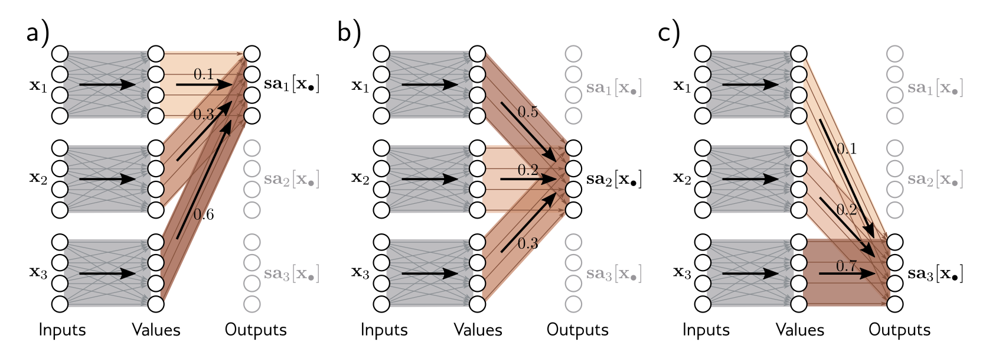

# How does self attention work?


Self-attention is the cornerstone of a transformer block. We are going to go through the intuition behind the following steps:

1. Tokenization
2. Embedding
3. The self attention mechanism

by using raw, non-vectorised Python code as much as possible.
<!-- more -->


The original transformer paper [here](https://arxiv.org/pdf/1706.03762.pdf) is actually easy to read for a technical paper, but difficult to wrap your head around if this is the first time you are dipping your toes into neural networks. Other resources, like "[The Illustrated Transformer](https://jalammar.github.io/illustrated-transformer/)" don't really have code. One resource that does have code is the "[Understanding Deep Learning](https://udlbook.github.io/udlbook/)" (UDL) book, that I will be leaning on heavily for this post.


Before we get to the famous equation -

$$
\text{selfAttention}[X] = V[X]\text{softmax}(\frac{QK^T}{\sqrt{D_q}})
$$

let's see what the steps often are *before* a matrix/tensor gets to the self-attention mechanism. 

Many images are from the UDL book, and a lot of the code is covered in the notebooks 
published alongside the book. 

Before diving into architectural details, we have to remind ourselves what the problem it is that transformers had set out to solve: [translation](https://blog.google/products/translate/found-translation-more-accurate-fluent-sentences-google-translate/) 

## Brief introduction to the problem of translation

Translation is the "flagship" natural language processing task. The general inputs and outputs of the problem are incredibly simple to describe - given a sequence of words in one language, return a sequence of words in another language automatically. 

```text
Input: I am a student.

Output: আমি একজন ছাত্র।
```

Before deep learning methods were used to tackle this problem, companies like Google used [statistical, phrase-based systems](https://toppandigital.com/translation-blog/google-ai-invents-language-translate-languages/) that did not work that well, and did not scale to many languages.

Nowadays, all dominant translation systems use neural networks to do their translation. 
### How do you train a  *neural* machine translation system?

There are many approaches to neural machine translation, but what I'll cover here is sequence to sequence way the ["Attention is all you need"](https://arxiv.org/pdf/1706.03762.pdf) paper did it.

We'll walk through the following broad sections:
1. Tokenization
2. Embedding
3. Self attention
## Tokenization - brief remarks
To use any neural based system, inputs and outputs must be vectors of floats. 
The process of converting words/sequence of words into vectors of floats is called tokenization. Tokenization won't be covered in detail here, and there are [several resources](https://www.youtube.com/watch?v=zduSFxRajkE&ab_channel=AndrejKarpathy) that go over the different techniques (my personal favourite is the series of [lectures from Stanford](https://www.youtube.com/watch?v=ERibwqs9p38&ab_channel=StanfordUniversitySchoolofEngineering)). The main thing to remember for tokenization is the input and the output - (example is from [HuggingFace](https://huggingface.co/docs/transformers/en/tokenizer_summary)): 

```python
from transformers import BertTokenizer

inp = "I love gpus!"

tokenizer = BertTokenizer.from_pretrained("google-bert/bert-base-uncased")

inp_str = "I have a new GPU!"
tokenizer.tokenize(inp_str)

# ['i', 'have', 'a', 'new', 'gp', '##u', '!'] => len= 7

# Huggingface's tokenizers' .encode() method tends to add a special start and end tokens

tokenizer.encode(inp_str)
# each number here represents the index of each token in the tokenizer's entire vocabulary
# [101, 1045, 2031, 1037, 2047, 14246, 2226, 999, 102] => len= 9 (7+2)

tokenizer.decode([101, 1045, 2031, 1037, 2047, 14246, 2226, 999, 102])

# '[CLS] i have a new gpu! [SEP]'
"""
CLS -> Special CLASSIFY token usually added to the beginning of a sequence
In HF tokenizers, this is usually 101

SEP -> separator token, usually added at the end of a sequence
In HF tokenizers, this is usually 102
"""
```

There are several popular tokenization schemes: the original Attention paper doesn't actually describe what tokenizing scheme it used, but it is commonly believed they used [byte pair encoding (BPE)](https://en.wikipedia.org/wiki/Byte_pair_encoding). The GPT family of models also use some variation of BPE, see for example [tiktoken](https://github.com/openai/tiktoken), which does BPE at a byte level. Doing BPE at a byte level (as opposed to the more classic Unicode word/character level tokenization) means you don't really have the "out of vocabulary" problem when you move from one modality to another.

Other popular tokenization methods are [WordPiece](https://huggingface.co/learn/nlp-course/en/chapter6/6) (which is used in the BERT paper), and [SentencePiece](https://github.com/google/sentencepiece) which can be used to tokenize multiple languages including non-Latin languages (which [Google's T5](https://arxiv.org/pdf/1910.10683) uses).

Depending on your use case, you can also implement your own tokenization scheme! Before the transformers paper for example, a briefly popular paper was the [ByteNet paper](https://arxiv.org/pdf/1610.10099) that did precisely this and implemented a character-level tokenization scheme. 

## Embedding
What happens after tokenziation? In the Huggingface transformer's library, after tokenisation, you get a sequence of $N$ tokens, each of which is an integer that represents the index in the tokeniser's vocabulary. 

What we then want to do is convert each of these integers into a vector $\in \mathbb{R}^D$ where $D$ is some embedding dimension that is smaller than the size of the vocabulary in the tokenizer. This means that the sequence of integers would be converted into a sequence of vectors, i.e. a matrix.

The way this is done in most architectures is through a simple look up table. If the size of the tokenizer's vocabulary is $N_{\text{vocab}}$ all we need is a $N_{\text{vocab}} \times D$ matrix, where row $i$ corresponds to the $D$ dimensional representation of token index $i$. This $N_{\text{vocab}} \times D$ matrix is *learnable*. 

Let's see how it happens in code:

Let's have a look at the inputs and outputs of `torch`'s `nn.Embedding` :
```python

import torch.nn as nn
import torch
embedding_dim = 3
vocab_size = 5
embedding_layer = nn.Embedding(vocab_size, embedding_dim)

# toy example - how would a sequence of ones [1., 1., ...] be embedded?
out = embedding_layer(torch.ones((6,), dtype=int))
out
```
prints the following:
```
tensor([
		[-0.8257, 0.0528, 1.3637],
		[-0.8257, 0.0528, 1.3637],
		[-0.8257, 0.0528, 1.3637],
		[-0.8257, 0.0528, 1.3637],
		[-0.8257, 0.0528, 1.3637],
		[-0.8257, 0.0528, 1.3637]],
		grad_fn=<EmbeddingBackward0>)
```
a 6x1 matrix. If you want to dig further into the nature of the embedding layer, you can see the following:

```python
embedding_layer.weight

tensor([
	[ 0.2668, -1.0410, -1.5245],
	[-0.8257, 0.0528, 1.3637],
	[-1.7534, -0.4505, -1.0951],
	[-0.6984, -1.7775, -1.3832],
	[ 2.5235, -0.7539, -2.1454]], requires_grad=True)
```

The output of  `embedding_layer(torch.ones((6,), dtype=int))` is basically the 2nd row (index of 1) `[-0.8257, 0.0528, 1.3637]` repeated 6 times. So all the embedding layer $N_{\text{vocab}} \times D$ does is act as a look-up matrix.

In pure python, the code for the embedding layer will be something as simple as:

```python
import random 

class PurePythonEmbeddingLayer:
	def __init__(self, vocab_size: int, embedding_dim: int):
		self.weight = [[random.random() for _ in range(embedding_dim)] for _ in range(vocab_size)]  # <- the trainable lookup!

	def forward(self, inputs: list[int]):
		out = []
		for inp in inputs:
			out.append(self.weight[inp])
		return out
	...
```

From this simple building block, you can make things as complicated as you want. The `BertEmbeddings` class in the `transformers` library shows you that for transformers, you will need to encode the position information of the text as well among other things. 

### Positional Embedding/Encoding
The original transformers paper also embeds the positional information into the input sequence to the self attention layers. What  does positional embeddings do?
Imagine if we didn't have the positional embeddings. When the self-attention mechanism is presented in the next section, you'll realise that each token embedding is treated independently of its position in a sentence. We need a way to "inject" the fact that a token's position is important *before* the embeddings enter as input into the self attention mechanism, where they will be further projected into many more different kind of vectors in different spaces. 

A motivating example would be something like processing a sentence - `a person ate the fish`. This has a completely different meaning to another ordering of the words - `a fish ate the person` - the positions of the words `fish` and `person` change the meaning of the phrases, and we need a mechanism to preserve that.

The way the original transformers paper did this was by using sinusoidal encodings. The scheme they use is something like 

$$
\text{PE}_{(pos, 2i)} = sin(\frac{pos}{10000^{\frac{2i}{d_\text{model}}}})
$$

for tokens in the even indexes of the hidden dimension, and

$$
\text{PE}_{(pos, 2i + 1)} = cos(\frac{pos}{10000^{\frac{2i}{d_\text{model}}}})
$$

for tokens in the odd index of the hidden dimension. 

These encodings would then be *added* to the learned embeddings. 

In pure python code, this would look something like this

```python
def positional_encoding(seq_len: int, d_model: int) -> list[list[float]]:
    """Given a sequence length, and a model embedding size, return a matrix
    of seq_len x d_model encoding the positions

    Args:
        seq_len: number of tokens
        d_model: dimensions of the input to the embedding vector

    Returns:
        a matrix of seq_len x d_model
    """
    def _get_angle(pos, d_i):
        denom = 10_000 ** ((2 * (d_i // 2)) / d_model)
        return pos / denom
    
    out = []
    for pos in range(seq_len):
        row = []
        for d_i in range(d_model):
            _fn = math.sin if d_i % 2 == 0 else math.cos
            angle = _get_angle(pos, d_i)
            row.append(_fn(angle))
        out.append(row)
        
    return out

```

When you plot it for `seq_len = 10` and `d_model = 64` (just toy values), you will get something like 

![[positional_encoding_from_paper.png]]
You can look at [Jay Alamar's code](https://github.com/jalammar/jalammar.github.io/blob/master/notebookes/transformer/transformer_positional_encoding_graph.ipynb) to see how to do this in a vectorised manner. 

In the old tensor2tensor library, the way positional encoding was done was actually by *not* interleaving the sines and cosines, but instead by doing something like this instead:

```python

def positional_encoding_concat(seq_len: int, d_model: int) -> list[list[float]]:
    """Given a sequence length, and a model embedding size, return a matrix
    of seq_len x d_model encoding the positions.
    
    The difference this time is that you don't interleave the sines and the cosines
    but follow the tensor2tensor style of just concatenating sines and cosines

    Args:
        seq_len: number of tokens
        d_model: dimensions of the input to the embedding vector

    Returns:
        a matrix of seq_len x d_model
    """
    def _get_angle(pos, d_i):
        denom = 10_000 ** (d_i / (d_model/2))
        return pos / denom
    
    out = []
    for pos in range(seq_len):
        row = []
        for d_i in range(d_model//2):
            angle = _get_angle(pos, d_i)
            row.append(math.sin(angle))
        for d_i in range(d_model//2):
            angle = _get_angle(pos, d_i)
            row.append(math.cos(angle))
        out.append(row)
        
    return out
```

for which you'd get the plot ![[positional_encoding_concat.png]]
The main difference being in
1. the `_get_angle` method
2. the for loop where the values are being appended

According to the [Tensorflow tutorial](https://www.tensorflow.org/text/tutorials/transformer#the_embedding_and_positional_encoding_layer) on transformers, these 2 are functionally equivalent. You can see why - the main aim of positional encodings is to make sure that embeddings that are near each other have a "similar" positional encoding, while those far away have different positional encodings. The second implementation is easier to do in a vectorised manner.

The advantage of positional encodings that use such a sinusoidal pattern is that it can generalise to sequence lengths not seen before during training, because it is a deterministic function with respect to the token's position in the input.

So the final embedding layer that includes positional encoding will look something like: 


```python
import random 

class PurePythonEmbeddingLayer:
	def __init__(self, vocab_size: int, embedding_dim: int):
		self.weight = [[random.random() for _ in range(embedding_dim)] for _ in range(vocab_size)]  # <- the trainable lookup!
		self.embedding_dim = embedding_dim

	def forward(self, inputs: list[int]):
		out = []
		positional_encodings = positional_encoding_concat(seq_len=len(inputs), d_model=self.embedding_dim)
		for i, inp in enumerate(inputs):
			token_embedding = self.weight[inp]
			positional_encoding = positional_encodings[i]
			out.append([_t + _p for _t, _p in zip(token_embedding, positional_encoding)])
		return out
	...
```


Why don't we just make the model learn how to embed position instead of hardcoding it? 
The answer to that is, you can! The BERT paper, which basically takes the original transformer paper and scales it up immensely, does precisely this. The `positional_embedding` is just another learnable parameter in the BERT encoder, as opposed to the deterministic vector you see in the original transformer paper. This increases the number of parameters a model has.
The disadvantage of a scheme like this is that at inference time, you cannot have sequence lengths that are longer than what the model has been trained at 

Other more sophisticated embedding schemes include [rotary positional embeddings](https://blog.eleuther.ai/rotary-embeddings/) (RoPE). RoPE is what the later versions of the GPT class of models use. This will not be discussed in greater detail here. 

Now that you have the embeddings ready, we are finally in a position to explain how the self attention mechanisms works. 

## Self-attention
### Why self-attention? Why not just use fully connected layers?
The UDL book makes a very compelling argument, that will be reproduced in part here. 

Here's an example of an actual review from Amazon:

<div style="overflow-x: auto; white-space: pre-wrap;"> 
<pre style="white-space: pre-wrap; word-wrap: break-word;">
in 1989, I managed a crummy bicycle shop, "Full Cycle" in Boulder, Colorado. The Samples had just recorded this album and they played most nights, at "Tulagi's" - a bar on 13th street. They told me they had been so broke and hungry, that they lived on the free samples at the local supermarkets - thus, the name. i used to fix their bikes for free, and even feed them, but they won't remember. That Sean Kelly is a gifted songwriter and singer.
</pre>
</div>
There are immediately 3 observations you can make about using just fully connected layers:

1. This is 83 word review, and roughly 110 tokens (remember - everything is in terms of token length!) worth of text. Imagine now that each token is represented by a vector of size 1024 (the embedding dimension $\textbf{D}$). If you were to have a model consisting only of fully connected layers, each layer would contain $N^2D^2$  parameters, and with $k$ such layers, you'd have $kN^2D^2$ such parameters. This is a lot of parameters.
2. Each review on Amazon can have a variable number of inputs. How would you take that into account when designing a model consisting only of fully connected layers? You could technically just fix the upper bound of N to some arbitrarily large value, and fill the positions with no text with some arbitrary "pad" tokens, but this feels like an inefficient way of learning representations. 
3. Language is inherently ambiguous, and it is unclear from syntax alone what the semantic meaning of each token is. 
	1. In the example above, the word `That` in the last sentence doesn't specifically refer to any object or subject. 
	2. This means that we want an architecture where there must be connections between word representations and that the strength of these connections should depend on the words themselves. 
	3. Technically you could have fully connected layers that do the same thing. In such a case, you'd hope the superfluous weights go to zero, and all weights that connect neurons that belong to the same group of tokens to other such groups would all be the same during the learning process. But this is an incredibly inefficient way of learning. This is probably easier to see in the diagram below. 
		1. In the top part, you want all the lines of the same colour to be the same weight.
		2. In the second part, you see that it is also technically possible to do this with fully connected layers, but this adds a lot of parameters for training without adding any real value, because we know the constraints we would like them to fulfill. 

![[fully_connected_layer_vs_self_attention.png]]

### Self attention block
We can now turn our attention to what the self attention block does. We will proceed from the outputs of the embedding layer as input to this block

If we were to use a standard neural network, each $D\times1$ input would have a *linear* transformation applied to it, followed by a *non-linear* activation function (softmax, ReLU etc.) applied to it. We can represent the mapping of a standard neural network on an input $\mathbf{x}$ as 

$$
f(\mathbf{x}) = \text{someNonLinearFunction}(\mathbf{Ax + b})
$$

How is a self attention block different?
The simplest way to think of a self attention block is in 2 steps.

Assume an input of $N$ vectors $x_1, x_2, .... x_N$, each of dimension $D$. 

The first step in an a self-attention block is the following - for each of the $N$ vectors, a corresponding *value* is computed using the standard way - 


$$
\mathbf{v}_m = \mathbf{A}_v\mathbf{x}_m + \mathbf{b}_v
$$

where $\mathbf{A} \in \mathbb{R}^{D\times D}, \mathbf{b} \in \mathbb{R}^{D}$ , are shared across *all* input vectors. You can see this in the description section of the original transformers paper. 

The second step is then computing a ***weighted*** sum across this set of values $\mathbf{v}_1,  ..., \mathbf{v}_N$ for each $i \in [1, N]$:

$$
\text{out}_i = \sum_{j=1}^{N}a(\mathbf{x}_j, \mathbf{x}_i)\mathbf{v}_j
$$

where $a(\mathbf{x}_j, \mathbf{x}_i)$ is the *attention* that the $i^{th}$ output pays to the $j^{th}$ input. A weighted sum means that for each $i$, the sum $\sum_{j=1}^{N}a(\mathbf{x}_j, \mathbf{x}_i) = 1$ , and each of the weights $a(\mathbf{x}_j, \mathbf{x}_i)$ is non-negative.

So what is the attention function? It's two inputs - the first is $\mathbf{x}_m$, i.e. the $m^{th}$ input vector, whose corresponding value vector $\mathbf{v}_m$ is what the result of the attention computation will be multiplied with. The second is $\mathbf{x}_i$, the $i^{th}$ input vector, where $i$ is also the position of the output vector we are trying to compute. We will need to compute 2 linear transformations first - the first being

$$
\mathbf{q}_i = \mathbf{A}_q\mathbf{x}_i + \mathbf{b}_q
$$

which is called the *query* value, computed on the output's $i^{th}$ position. The second linear transformation is 

$$
\mathbf{k}_m = \mathbf{A}_k\mathbf{x}_m + \mathbf{b}_k
$$

which is called the *key* value, computed on the $m^{th}$ input vector. 

The attention function $a(\mathbf{x}_j, \mathbf{x}_i)$ will then be defined as:

$$
a(\mathbf{x}_j, \mathbf{x}_i) := \text{softmax}_m(\mathbf{k}^T_{\circ}\mathbf{q}_i) \\ = \frac{\text{exp}(\mathbf{k}^T_j\mathbf{q}_i)}{\sum_{j'=1}^{N}\text{exp}(\mathbf{k}_{j'}^T\mathbf{q}_i)}
$$


The following diagram from the UDL book is instructive to visualise the 2 different stages of calculating the 



All this seems pretty unintuitive - what is the correct "mental model" to have for the *key*, *query*, and *value* vectors we have just introduced? I'm going to modify the insight Eugene Yan's blog [here](https://eugeneyan.com/writing/attention/) has on this - 

1. Say you are in a library, and you want some knowledge. To get knowledge, you basically want the answers to N queries you have. 
2. Now in the library, there are a lot of books. Each book has a spine with its title, which you can think of as its *key*, and each book has some content, which is it's *value*. 
3. Now, *for each* query you have, you look at the spine of each book to decide how much *attention* should give to the contents of that book for that particular query, and you do it for all books present in the library.

Keys and values tend to be computed on the same input matrices, but *query* values are often computed on other input matrices (it is called *self-attention* when all these operations are on the same inputs). As an example of these operations being applied to different inputs, you have to look no further than the "Attention is all you need" paper, particularly this diagram: 

![[Pasted image 20240708103846.png]]

In the decoder, at the point in the model where the decoder takes into account the encoder outputs as well, the key and values will be computed as:

$$
K = A_kX_{\text{enc}} + B_k
$$

$$
V = A_vX_{\text{enc}} + B_v
$$

while the queries will be on the decoder representation of the outputs:

$$
Q = A_qX_{\text{dec}} + B_q
$$

where $X_{\text{enc}}, X_{\text{dec}}$ are the matrices as illustrated in the diagram above - $X_{\text{enc}}$ being the encoder 
output, and $X_{\text{dec}}$ being the decoder representation of the output embedding at that layer (assume column first ordering for this series of equations). 

This is sometimes called *cross-attention*, and if you inspect the Huggingface code, you will see this term cropping up. Let's focus just on self-attention again.

What does this all look like in code? You can look at the notebooks provided by the author of the UDL book for a clearer understanding, and I'm going to reproduce something very similar to the book here.

For our toy example, let's assume the output of the embeddings are 3 input vectors $\mathbf{x}_1, \mathbf{x}_2, \mathbf{x}_3$ , each with dimension $D = 4$.  

```python
import numpy as np
# Set seed so we get the same random numbers
np.random.seed(3)
# Number of inputs
N = 3
# Number of dimensions of each input
D = 4

all_x = []
# Create elements x_n and append to list
for n in range(N):
  all_x.append(np.random.normal(size=(D,1)))  # <- doesn't really matter for this toy example

print(all_x)
```

Now, let's initialise the weights for $A_q, A_k, A_v$ and biases $b_q, b_k, b_v$: 

```python
# all the weights are of dimension DxD 
A_q = np.random.normal(size=(D,D))
A_k = np.random.normal(size=(D,D))
A_v = np.random.normal(size=(D,D))

# all the biases are of dimension Dx1
b_q = np.random.normal(size=(D,1))
b_k = np.random.normal(size=(D,1))
b_v = np.random.normal(size=(D,1))
```

We can now compute the keys, queries, and values for each of inputs:

```python
# Make three lists to store queries, keys, and values
all_queries = []
all_keys = []
all_values = []
# For every input
for x in all_x:
  query = A_q @ x + b_q
  key = A_k @ x + b_k 
  value = A_v @ x + b_v

  all_queries.append(query)
  all_keys.append(key)
  all_values.append(value)
```

Side note regarding multiplying numpy arrays: the `@` operator is a standard matrix multiplication operation, and requires 2 matrices of dimensions $A \times B$,  and $B \times C$, and will result in a $A\times C$ matrix. The `*` operator can only be used if your matrix pair $M_1, M_2$ are either vectors or square matrices, and is often not what you want. 

We then need the softmax function:
```python
def softmax(items_in: list):
  e_x = np.exp(items_in - np.max(items_in))
  return e_x / e_x.sum()

```
Subtracting the maximum value in the exponent is a common technique to make sure the values in the numerator (`e_x` in the snippet above) do not become too large, and you have to start worrying about things like overflow etc. in the underlying programming language. Functionally they don't change the softmax function, since

$$
\frac{e^{x_i}}{\sum^{N}_{i=1}{e^{x_i}}} = \frac{(\frac{1}{e^C})e^{x_i}}{(\frac{1}{e^C})\sum^{N}_{i=1}{e^{x_i}}} = \frac{e^{x_i - C}}{\sum^{N}_{i=1}{e^{x_i - C}}}
$$

For a pretty interesting discussion about why we use softmax, and the interpretation of this non-linear function, feel free to look at Pinecone's handy guide [here](https://www.pinecone.io/learn/softmax-activation/).  

We are now in a position to compute each of the outputs. As a reminder, we are going to have $N$ output vectors $\text{out}_1, \text{out}_2, \text{out}_3, ... \text{out}_N$, each of which is a weighted average of the value vectors. 


```python
# Make three lists to store queries, keys, and values
all_queries = []
all_keys = []
all_values = []
# For every input
for x in all_x:
  query = A_q @ x + b_q
  key = A_k @ x + b_k 
  value = A_v @ x + b_v

  all_queries.append(query)
  all_keys.append(key)
  all_values.append(value)

# compute the outs
all_outs = []

for i in range(N):
	all_kj_qi = [] # <-- will be a 1 x N vector
	q_i = all_queries[i]
	for key_j in all_keys:
		dot_product = np.dot(key_j.T, q_i).squeeze()
		all_kj_qi.append(dot_product)

	attention = softmax(all_kj_qi) # <-- 1 x N vector that sums to 1
	out_i = sum(attention[i] * all_values[i] for i in range(N))
	all_outs.append(out_i)
```

And that is it! You have basically implemented the self-attention mechanism from scratch using just (mostly) raw python loops! If you want to involve more matrix operations, you can do it the following way: 

```python
def softmax_cols(data_in):
    # Exponentiate all of the values
    _data_in = data_in - np.max(data_in, axis=1, keepdims=True)
    exp_values = np.exp(_data_in)
    # Sum over rows
    denom = np.sum(exp_values, axis=1, keepdims=True)
    # Compute softmax
    softmax = exp_values / denom
    # return the answer
    return softmax

def self_attention(X, A_v, A_q, A_k, b_v, b_q, b_k):
    """Self attention in a vectorized manner

    Assumption here is that each column of X is a data point. In literature, each data point is usually a row, and not a column. Doesn't change the main thrust of this function
    
    Args:
        X: X is a DxN matrix, where D is the dimension of the input vectors, and N is the number of input vectors
        A_v: A_v is a DxD matrix
        A_q: A_q is a DxD matrix
        A_k: A_k is a DxD matrix
        b_v: b_v is a Dx1 vector
        b_q: b_q is a Dx1 vector
        b_k: b_k is a Dx1 vector

    Returns:
        a DxN matrix, where each column is the output of the self attention mechanism
    """
    # 1. Compute queries, keys, and values
	Q = X @ A_q.T + b_q.T
	K = X @ A_k.T + b_k.T
	V = X @ A_v.T + b_v.T
    # 2. Compute dot products
    dot_pdts = Q @ K.T
    # 3. Apply softmax to calculate attentions
    attention = softmax_cols(dot_pdts)
    print(attention.shape) # <-- This will now be a NxN matrix!
    # 4. Weight values by attentions
    out = attention @ V
    
    return out

X = np.array(all_x).squeeze()
out = self_attention(X, A_v, A_q, A_k, b_v, b_q, b_k)
```

This function presents the famous self-attention equation:

$$
\text{attentionOutput}(V, Q, K) = V\text{softmax}(QK^T)
$$

more naturally. 

If you inspect the values of the $N\times N$ `attention` matrix, you'll notice the extreme values - some values are very close to 1, and many values are nearly 0. This is because there is a large variance in the values of $QK^T$ - they become either too big a positive value, or too big a negative value. 

We ideally want to scale the values in the attention such that the variance in the input values to the softmax function is reduced to avoid the vanishing gradient problem. A hand-wavy justification for this is the following:

Weights in a neural network are updated using backpropagation (you can read up the details of this method elsewhere). Let the $i^{th}$ output of the softmax function be defined as $p_i$ where

$$
p_i = \frac{e^{x_i}}{\sum^{N}_{i=1}{e^{x_i}}}
$$

Then, when we look at the gradients of this function, we can see that the partial derivative of $p_i$ with respect to $x_i$ is -

$$
\frac{\partial p_i}{\partial x_i} = \frac{\partial}{x_i} \left( \frac{e^{x_i}}{e^{x_i}+ C} \right) = \frac{(e^{x_i} + C)e^{x_i} - e^{x_i}e^{x_i}}{(e^{x_i} + C)^2} = (\frac{e^{x_i}}{e^{x_i}+ C})(\frac{C}{e^{x_i}+ C}) = p_i(1 - p_i)
$$

where we use $C$ in that hand-wavy way non-mathematicians use to express terms that can be treated as a "constant" in a partial derivative. Then for $j\neq i$, 

$$
\frac{\partial p_i}{\partial x_j} = \frac{\partial}{x_i}\left(\frac{C'}{e^{x_j}+ C}\right) = \frac{-C'e^{x_j}}{(e^{x_j}+ C)^2} = -p_jp_i
$$

The last characteristic you need to remember about the softmax is the following: 

$$
\sum_{i=1}^N p_i = 1
$$


So if any $p_i$ is very close to one, the partial derivatives will be *close to 0* because the other term (either $1 - p_i$ or $p_j$) is going to be very close to 0. Naturally, the partial derivatives will also be close to 0 if any of the $p_i$'s is close to 0. 

Scaling the inputs the softmax function is typically done by dividing the $\mathbf{Q}\mathbf{K^T}$ result with $\sqrt{D_k}$ , i.e. the dimension of the keys (and the dimension of the queries). Why this particular constant? This is explained in the paper. As the dimensions of the keys and the queries increase, it is likely that the final result of $\mathbf{Q}\mathbf{K^T}$ increases in value. Intuitively, this is because if $q$ and $k$ are independent random variables with 0 mean and 1 variance, the dot product $q \cdot k = \sum_{i=1}^{d_k} q_ik_i$ will have mean 0 and variance $d_k$. 
This is easy to derive from first principles, remembering that $\text{Var}[x]) = \mathbb{E}[x^2] - (\mathbb{E}[x])^2$ . The mean calculation of $\mathbf{k}^T \cdot \mathbf{q}$ is the following (with $D$ being the dimension of the key and the query)

$$
\mathbb{E}[\mathbf{k}^T \cdot \mathbf{q}] = \mathbb{E}\left[ \sum_{i=1}^{D} k_iq_i \right] = \sum_{i=1}^D \mathbb{E}[q_ik_i]
$$

and since $k_i, q_i$ are independent, you have 

$$
\sum_{i=1}^D \mathbb{E}[q_ik_i] = \sum_{i=1}^D \mathbb{E}[q_i]\mathbb{E}[k_i] = 0
$$

As for variance we need to consider the following:  

$$
\text{Var}[\mathbf{k}^T \cdot \mathbf{q}] = \mathbb{E}\left[(\mathbf{k}^T \cdot \mathbf{q})^2\right] - \left(\mathbb{E}[\mathbf{k}^T \cdot \mathbf{q}] \right)^2
$$

We only have to consider the first term of the right hand side, because as we've just established, $\mathbb{E}[\mathbf{k}^T \cdot \mathbf{q}]=0$. Given that each of these variables have variance 1, this means that:

$$
\text{Var}(k_i) = 1 => \mathbb{E}[k_i^2] - (\mathbb{E}[k_i])^2 = 1
$$

and since $\mathbb{E}[k_i]=0$, we know $\mathbb{E}[k_i^2] = 1$. The same holds for $q_i$.

So, it easily follows:

$$
\text{Var}[\mathbf{k}^T \cdot \mathbf{q}] = \mathbb{E}\left[(\mathbf{k}^T \cdot \mathbf{q})^2\right] = \mathbb{E}\left[ \left( \sum_{i=1}^Dk_iq_i \right) \left( \sum_{j=1}^Dk_jq_j \right) \right] =\left[ \sum_{i=1}^D \sum_{j=1}^D  \mathbb{E}(q_iq_jk_ik_j)\right]
$$

and since the $k$'s and the $q$'s are independent:

$$
\left[ \sum_{i=1}^D \sum_{j=1}^D  \mathbb{E}(q_iq_jk_ik_j)\right] = \left[ \sum_{i=1}^D \sum_{j=1}^D  \mathbb{E}(q_iq_j)\mathbb{E}(k_ik_j)\right]
$$

now, for cases where $i \neq j$, you get $\mathbb{E}(q_iq_j) = \mathbb{E}(q_i)\mathbb{E}(q_j) = 0$, and so you only have to care about the cases where $i = j$. This then simplifies everything to: 

$$
 \left[ \sum_{i=1}^D \sum_{j=1}^D  \mathbb{E}(q_iq_j)\mathbb{E}(k_ik_j)\right] = \sum_{i=1}^D \mathbb{E}(q_i^2) \mathbb{E}(k_i^2) =\sum_{i=1}^D 1= D
$$

So to summarise this last part - the reason we scale everything by $\sqrt{D_k}$ is because under the assumption that $k$'s and $q$'s are independent variables with 0 mean and unit variance, this is the scaling factor we need to keep the variance of 

$$
\mathbf{k}^T \cdot \mathbf{q}
$$

to 1, and the mean to be 0. 

The self attention block is the basic unit of the transformer, and its details are often not appreciated. Hopefully, this post has given you a better intuition for it by decomposing every step into its most basic form.  