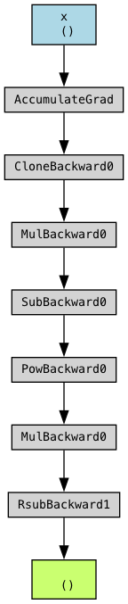
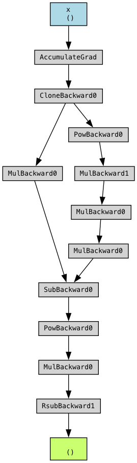

I noticed something interesting about PyTorch while implementing the [MAML paper](https://arxiv.org/pdf/1703.03400). 

<!-- more -->

## MAML Pseudocode


The general algorithm presented in the paper can be summarised by the following pseudocode:

```txt
Initialize θ

for _ in range(num_outer_steps):
    Sample a batch of tasks {T_i} ~ p(T), where P(T) is your distribution of tasks (such as the omniglot dataset)
	
	all_losses = []
    for each task T_i in {T_i}:
        # Split data into support set D_i^support and query set D_i^query

        for _ in range(num_inner_steps)
        # 1) Compute adapted parameters using one or more gradient steps on D_i^support:
	        θ_i' = θ - α * ∇_θ L_Ti(θ, D_i^support)
        
        # 2) Evaluate loss on the query set D_i^query using the adapted parameters θ_i':
        L_Ti_query(θ_i') = L_Ti(θ_i', D_i^query)
        update_all_losses(all_losses, L_Ti_query(θ_i'))

    # 3) Compute average query loss across all tasks
    L_Ti_query_avg(θ_i') = compute_avg(all_losses)

	# 4) Compute the meta-gradient:
    θ ← θ - β * ∇_θ Σ_i [ L_Ti_query_avg(θ_i') ]

```

Refer to the paper for the motivation for doing training and inference using this method. The big idea here is that instead of training the model to predict something specific, you show the model *examples* (i.e. the support set) and then from there you teach it to infer the correct answer on the *query set*. 

So during training, your *training set* would consist of a **support set** and a **query set**, and the model's task is to predict the correct answer for the query set, *given* the support set. At test time, you'd pass in a support set as well - or your *context*, to use the today's LLM obsessed terminology - and ask the model to predict the answer for the query set. This is basically in-context learning. 

A couple of things to remember: 

1. **Inner Loop (Adaptation):** For each task, you temporarily update the model parameters by one (or a few) gradient steps using the support split.
2. **Outer Loop (Meta-Update):** You then compute how well the _adapted_ parameters perform on the corresponding query split. **This performance** drives the gradient update on the _original_ (meta) parameters $\theta$, i.e. loss from the query set is what is used to do the gradient updates on the parameters.
3. **Backprop Through Adaptation:** The outer update must differentiate through the inner loop (the adaptation step). This is how the support set helps in training - when the loss from the query set is used to do updates of the parameters, it implicitly includes the losses from the adaptation step. This is explained in the last sections.


### Non-optimized pytorch code for using MAML on any generic nn.Module

How would you implement this in Pytorch? The author of the original paper (Professor Chelsea Finn) used ConvNets as an example, and [did so](https://github.com/cbfinn/maml/blob/master/maml.py) in TensorFlow V1 which is not readable for mere mortals.

The concept though is simple enough, and can be re-written in PyTorch for any generic `nn.Module` subclass

Below is how I'd implement MAML at a high level using PyTorch. Some syntactical liberties have been taken, and this code won't necessarily work if you copy paste it. Even if it did, it is probably going to be slow, but you should be able to work around it by optimizing individual components. 


```python
import copy
import torch
import torch.nn as nn
import torch.optim as optim

def init_model_with_params(base_model: nn.Module, params: dict[str, torch.Tensor]):
    """
    Create a new copy of 'base_model' and load the given 'params' 
    (list of Tensors) into it as its parameters.

    Args:
        base_model (nn.Module): The model whose architecture we want to replicate.
        params (List[Tensor]): A dict of parameter tensors in the same order 
            as base_model.named_parameters().

    Returns:
        nn.Module: A new model instance whose parameters match 'params'.
    """
    # 1) Deepcopy the structure of base_model to get a fresh model.
    #    This copy initially has the same weights as base_model.
    new_model = copy.deepcopy(base_model)

    # 2) Iterate through new_model's parameters and replace with those from 'params'.
    #    We'll zip over the named_parameters of the new model and the list of adapted params.
    for (_, p), (_, adapted_p) in zip(new_model.named_parameters(), params.items()):
        p.data.copy_(adapted_p.data)

    return new_model

def forward_with_params(base_model: nn.Module, params, x):
    """
    Generic forward pass using a new set of 'params'.
    Instantiates a new model, loads 'params' into it, and computes the forward pass.
    """
    # Rebuild a new model whose parameters match 'params'
    model_copy = init_model_with_params(base_model, params)
    # Forward pass
    return model_copy(x)

def clone_params(model: nn.Module):
    """Return a dict of parameter clones for the current model parameters."""
    return dict(model.named_parameters())

def inner_loop(
	base_model,
	params,
	x_train,
	y_train,
	loss_fn,
	lr,
	num_inner_steps,
	train: bool,
):
    """
    Perform the MAML inner loop adaptation step.
    """
    # Forward with current 'params'
    cloned_params = clone_params(model)
    for _ in range(num_inner_steps):
	    y_pred = forward_with_params(base_model, params, x_train)
	    train_loss = loss_fn(y_pred, y_train)
	
	    # Compute gradients wrt 'params'
	    grads = torch.autograd.grad(train_loss, params, create_graph=train)
	
	    # Gradient descent update
	    # can make lr a dict to pass in different learning rates for different parameters
	    cloned_params = {
		    k: v - lr * grad
		    for (k, v), grad in zip(cloned_params.items(), grads)
	    }

    return cloned_params

# Some random model architecture. Could be anything really
class SomeModel(nn.Module):

    def __init__(self, input_dim, hidden_dim, output_dim):
        super().__init__()
        self.fc1 = nn.Linear(input_dim, hidden_dim)
        self.relu = nn.ReLU()
        self.fc2 = nn.Linear(hidden_dim, output_dim)

    def forward(self, x):
        return self.fc2(self.relu(self.fc1(x)))

def main():
	# 2) Hyperparameters
	meta_lr = 1e-3
	inner_lr = 0.1
	outer_optimizer = optim.Adam(model.parameters(), lr=meta_lr)
	loss_fn = nn.CrossEntropyLoss()
	
	# Just an example loop with random data
	num_meta_updates = 100
	meta_batch_size = 4
	num_inner_steps = 5
	
	for meta_iter in range(num_meta_updates):
	    outer_optimizer.zero_grad()
	
	    meta_loss = 0.0
	    for task_i in range(meta_batch_size):
	        # Sample support and query data for the task
	        x_train = torch.randn(32, 784)
	        y_train = torch.randint(0, 10, (32,))
	        x_val   = torch.randn(32, 784)
	        y_val   = torch.randint(0, 10, (32,))
	
	        # Clone the base model's params
	        fast_weights = clone_params(model)
	
	        # --- Inner Loop: Adaptation ---
	        fast_weights = inner_loop(model, fast_weights, x_train, y_train, loss_fn, inner_lr, num_inner_steps)
	
	        # --- Compute the loss using updated (fast) params on the validation set ---
	        val_pred = forward_with_params(model, fast_weights, x_val)
	        val_loss = loss_fn(val_pred, y_val)
	
	        meta_loss += val_loss
	
	    meta_loss = meta_loss / meta_batch_size
	
	    # Outer loop update (meta update)
	    meta_loss.backward()
	    outer_optimizer.step()
	
	    if meta_iter % 10 == 0:
	        print(f"[Iteration {meta_iter}] Meta Loss: {meta_loss.item():.4f}")

if __name__ == "__main__":
	main()
```

##  PyTorch shenanigans
The code above has a number of features of PyTorch that you may not be familiar with if you're just starting out with PyTorch. I will try and point out the most "interesting" features. 

### torch.autograd.grad

Why do we use `torch.autograd.grad`? Usually, in most PyTorch training loops, we use `loss_tensor.backward()`, and then do `optimizer.step`. Let's look at what the `.backwards` method does

When using `.backwards`, gradients get accumulated when you do multiple backwards over a particular param:
```python
x1 = torch.tensor(3., requires_grad=True)
x2 = torch.tensor(4., requires_grad=True)
x3 = torch.tensor(5., requires_grad=True)

y1 = 3 * (x1**2) * (x2**2) * (x3 ** 2)
y2 = 3 * (x1**2) * (x2**2) * (x3 ** 2)

print(x1.grad)
y1.backward()
print(x1.grad)
y2.backward()
print(x1.grad)

"""
None
tensor(7200.)
tensor(14400.)
"""
```

Here you have 2 variables $y_1$ and $y_2$ both of which depend on $x_1$. When you do `.backward` on each, the gradient on $x_1$ accumulates - first being `7200` from the first `.backward`, and then having another `7200` added from the second `.backward` for a final value of `14400`. 

Now, when you use `torch.autograd.grad`, the gradients of the tensor do not accumulate:

```python
x1 = torch.tensor(3., requires_grad=True)
x2 = torch.tensor(4., requires_grad=True)
x3 = torch.tensor(5., requires_grad=True)

y1 = 3 * (x1**2) * (x2**2) * (x3 ** 2)
y2 = 3 * (x1**2) * (x2**2) * (x3 ** 2)

print(x1.grad)
first_grads = torch.autograd.grad(y1, [x1, x2, x3])
print(x1.grad)
y2.backward()
print(x1.grad)

"""
None
None
tensor(7200.)
"""

```


### Run time comparisons of 2 different ways of doing vanilla SGD

Another thing to notice in the MAML code is the fact that in the `inner_loop`, we are simply doing gradient descent on the inner parameters. In `pytorch`, there are classes such as `torch.optim.SGD` that do this for us, and that we use in regular training loops for standard deep learning model training. It is possible to rewrite the entire code of the `inner_loop` to use these built in classes of optimizers, but is there a cost? 

Beyond issues of readability - using `torch.optim.SGD` does the updates of the model parameters implicitly, and is therefore something I do not like - is there a hit we are taking performance-wise when we write the `for` loops ourselves in the `inner_loop`?

To test this, let's look at the code snippet below, which is basically comparing the runtime of a method that does gradient descent using a python for-loop "by hand" in `calculate_using_grad`, and one that uses `torch.optim.SGD` in `calculate_using_optim`. To prove that the final results are the same, there is also a method `compare_models_close`. 

```python
import torch
import time
import torch.nn as nn
from copy import deepcopy
import torch.nn.functional as F
from pathlib import Path
from tqdm import tqdm

RANDOM_IMAGE_PATH = "path/to/some/png_img.png"

def load_image(file_path):
    """
    Returns a Tensor containing image data
            shape (1, 28, 28)
    """
    x = imageio.imread(file_path)
    x = torch.tensor(x, dtype=torch.float32).reshape([1, 28, 28]) / x.max()
    return 1 - x


def compare_models_close(
    model1: nn.Module,
    model2: nn.Module,
    rtol=1e-3,
):
    params1 = model1.state_dict()
    params2 = model2.state_dict()

    if params1.keys() != params2.keys():
        print("params different!")
        print(f"model1: {params1.keys()}")
        print(f"model2: {params2.keys()}")
        return False

    for param_name in params1:
        if not torch.allclose(
            params1[param_name],
            params2[param_name],
            rtol=rtol,
        ):
            print(f"param_name: {param_name} not equal!")
            print(f"model1: {params1[param_name]}")
            print(f"model2: {params2[param_name]}")
            return False

    return True


class OmniglotCNN(nn.Module):
    def __init__(
        self,
        num_classes: int,
        in_channels: int = 1,
        num_hidden_channels: int = 32,
        kernel_size: int = 3,
        num_conv_layers: int = 4,
    ):
        super().__init__()
        layers = []
        cur_in_channels = in_channels
        for _ in range(num_conv_layers):
            conv = nn.Conv2d(
                cur_in_channels,
                num_hidden_channels,
                kernel_size=kernel_size,
                padding="same",
            )
            nn.init.xavier_uniform_(conv.weight)
            layers.append(conv)
            layers.append(nn.BatchNorm2d(num_features=num_hidden_channels))
            layers.append(nn.ReLU())
            cur_in_channels = num_hidden_channels

        self.layers = nn.Sequential(*layers)
        self.linear = nn.Linear(num_hidden_channels, num_classes)

    def forward(self, x: torch.Tensor):
        x = self.layers(x)
        x = x.mean(dim=[2, 3])
        return self.linear(x)


def get_image(
    image_path: Path = RANDOM_IMAGE_PATH,
) -> torch.Tensor:
    return load_image(image_path)


def calculate_using_optim(
    model: nn.Module,
    img: torch.Tensor,
    target: torch.Tensor,
    num_steps: int = 10,
    lr: float = 0.4,
) -> nn.Module:
    inner_optimizer = torch.optim.SGD(model.parameters(), lr=lr)
    for _ in range(num_steps):
        inner_optimizer.zero_grad()
        out = model(img.unsqueeze(0))
        loss = F.cross_entropy(out, target.unsqueeze(0))
        loss.backward()
        inner_optimizer.step()

    return model


def calculate_using_grad(
    model: nn.Module,
    img: torch.Tensor,
    target: torch.Tensor,
    num_steps: int = 10,
    lr: float = 0.4,
) -> nn.Module:
    for _ in range(num_steps):
        out = model(img.unsqueeze(0))
        loss = F.cross_entropy(out, target.unsqueeze(0))
        gradients = torch.autograd.grad(loss, model.parameters())

        with torch.no_grad():
            for param, grad in zip(model.parameters(), gradients):
                param.data -= grad * lr

    return model


def main():
    torch.manual_seed(123)
    num_classes = 5
    model = OmniglotCNN(num_classes=num_classes)
    model_copy = deepcopy(model)
    lr = 0.4
    img = get_image()
    target = torch.zeros(5, dtype=float)
    target[0] = 1.0
    num_experiments = 100

    start = time.time()
    for _ in tqdm(range(num_experiments)):
        calculate_using_optim(
            model=model,
            img=img,
            target=target,
            lr=lr,
        )
    end = time.time()
    duration = end - start
    print(f"model using optim: {duration}")
    start = time.time()
    for _ in tqdm(range(num_experiments)):
        calculate_using_grad(
            model=model_copy,
            img=img,
            target=target,
            lr=lr,
        )
    end = time.time()
    duration = end - start
    print(f"model using grad: {duration}")
    assert compare_models_close(model, model_copy)


if __name__ == "__main__":
    main()

```

The output would be the following:
```
model using optim: 3.6533949375152586
model using grad: 1.864612102508545
```

i.e. writing your own `for` loop is *faster* than using the in-built `torch.optim.SGD`! 

This was counterintuitive to me because one would assume that the in-built PyTorch class like would do gradient descent faster than a method that uses raw Python for-loops in its implementation. 

But this makes sense the moment you look at how `torch.optim.SGD` is implemented - for example, there is a lot of movement of data to/from a `buffer`, and a lot of cloning of tensors. I will not cover the details of how `torch.optim.SGD` is implemented, and would recommend interested readers to go take a look yourself to satisfy yourself that it is indeed quite slow.

### Clones
You will notice that in the `inner_loop`, the adapted parameters get initialised by cloning the parameters of the meta model. What does this do to the gradients? To investigate this let's take a look at the following code:

```python
x = torch.tensor(3., requires_grad=True)
sgd_optim = torch.optim.SGD(params=[x], lr=0.4)
sgd_optim.zero_grad()
x_copy = torch.clone(x)
x_copy = x_copy - 2.
y = 2*(x_copy**4)
# define loss arbitrarily, just say 1-y for now
loss = 1. - y
loss.backward()
sgd_optim.step()
print(x)
print(x_copy)

"""
tensor(6.2000, requires_grad=True)
tensor(1., grad_fn=<SubBackward0>)
"""
```

1. First, x = torch.tensor(3., requires_grad=True) creates our starting tensor with value 3.0. We turn on gradient tracking because we'll need to optimize this value.
2. `sgd_optim = torch.optim.SGD(params=[x], lr=0.4)` sets up the SGD optimizer with a learning rate of 0.4. This optimizer will only update the tensor x as it in the only tensor "registered" to the optimizer
3. sgd_optim.zero_grad() clears any existing gradients, giving us a clean slate.
4. Now comes the interesting part. x_copy = torch.clone(x) creates a copy of x with value 3.0. Then x_copy = x_copy - 2. subtracts 2 from x_copy, making x_copy = 1.0. This subtraction maintains the computational graph connection to x.
5. y = 2*(x_copy**4) computes y = 2 * (1.0^4) = 2 * 1 = 2
6. loss = 1. - y computes loss = 1 - 2 = -1
7. When loss.backward() computes gradients, it flows like this:
	1. d(loss)/dy = -1
	2. d(y)/d(x_copy) = 8 * (x_copy^3) = 8 * 1 = 8
	3. d(x_copy)/dx = 1 (from the clone and subtract operations)
	4. Therefore, d(loss)/dx = -1 * 8 * 1 = -8
8. sgd_optim.step() updates x using the gradient and learning rate:
	1. new_x = x - lr * gradient
	2. new_x = 3.0 - 0.4 * (-8) = 3.0 + 3.2 = 6.2


This is why the print statements will show:
1. x = 6.2 (the updated value after optimization)
2. x_copy = 1.0 (the original copied value minus 2)


The key insight here is that even though we modified x_copy with subtraction, the computational graph still maintains the connection back to x. However, the gradient that flows back to x is different because x_copy now represents a different value (1.0 instead of 3.0) when computing y. This leads to a smaller gradient (-8 instead of -216 if you did not have the `x_copy = x_copy - 2.` line) and thus a smaller update to x.
This example nicely illustrates how PyTorch's autograd system can handle multiple operations while maintaining gradient flow through the computational graph. 

Let's look at a more complicated example:
```python
x = torch.tensor(3., requires_grad=True)
lr = 0.4
outer_optim = torch.optim.SGD(params=[x], lr=lr)
# simulate inner loop
x_inner = torch.clone(x)
# define y_inner arbitrarily
y_inner = 2*(x_inner**4) # 2 * (3^4) = 162
# define inner loss arbitrarily
inner_loss = 2. - y_inner # 2 - 162 = -160
gradients = torch.autograd.grad(inner_loss, x_inner) # diff of 2 - 2x^4 => -8x^3 @ (x = 3) => -216
print(f"num of inner grads: {len(gradients)}")
# arbitrary update - NOT what happens in MAML
x_inner = 2 * x_inner - lr * gradients[0] # 6 - 0.4*(-216) = 92.4

# now simulate the outer loop gradient update
# define y_outer arbitrarily
y_outer = 3 * (x_inner ** 2)  # 3 * (92.4 ^ 2) = 25613.28
# define outer loss arbitrarily
outer_loss = 1. - y_outer # 1 - 25613.28 = -25612.28
print(f"outer_loss: {outer_loss}")
outer_loss.backward()
outer_optim.step()

print(f"x_inner: {x_inner}, x_inner.grad: {x_inner.grad}")
print(f"x: {x}, x.grad: {x.grad}")
```

The final print statements will have the following output:

```
num of inner grads: 1
outer_loss: -25612.28125
x_inner: 92.4000015258789, x_inner.grad: None
x: 446.52001953125, x.grad: -1108.800048828125
```

To see why the final values of `x` and `x.grad` are what they are, let's work out what `x.grad` will be, and then we'll see what `x` is.

The final `outer_loss.backward()` will basically accumulate the gradient on `x` such that `x.grad` will be `d(outer_loss)/d(x)`. Using the chain rule, you basically have 

```
d(outer_loss)/d(x) = [d(outer_loss) / d(x_inner)] * [d(x_inner) / d(x)]
```
The first term `[d(outer_loss) / d(x_inner)]` will basically be `d(1 - 3*x_inner^2)/d(x_inner) = -6*x_inner` @ `x_inner = 92.4`, so it will be `-554.4`.

The second term is 2. This comes from the line 

```
x_inner = 2 * x_inner - lr * gradients[0]
```
where we overwrite the value of `x_inner` (originally just a clone of x) with a new update. *We ignore the contribution of `lr * gradients[0]` to the* `[d(x_inner) / d(x)]` *derivative!* The reason for this is PyTorch has not stored the computation graph from `gradients[0]` to `x`. 

The key reason for this is that  `create_graph=False` by default in the inner gradient update. This is *not* what the MAML algorithm is! What happens if you do set that parameter to `true`?
### create_graph=True

You will also notice that when doing `torch.autograd.grad` in the MAML algorithm in the `inner_loop`, we set `create_graph=True`. How does this affect anything?

Let's use the exact same code as the more complicated case above, with the only difference being setting `create_graph = True` in the `torch.autograd.grad` line:

```python
x = torch.tensor(3., requires_grad=True)
lr = 0.4
outer_optim = torch.optim.SGD(params=[x], lr=lr)
# simulate inner loop
x_inner = torch.clone(x)
# define y_inner arbitrarily
y_inner = 2*(x_inner**4) # 2 * (3^4) = 162
# define inner loss arbitrarily
inner_loss = 2. - y_inner # 2 - 162 = -160
gradients = torch.autograd.grad(inner_loss, x_inner, create_graph=True) # diff of 2 - 2x^4 => -8x^3 @ (x = 3) => -216
print(f"num of inner grads: {len(gradients)}")
# arbitrary update - NOT what happens in MAML
x_inner = 2 * x_inner - lr * gradients[0] # 6 - 0.4*(-216) = 92.4

# now simulate the outer loop gradient update
# define y_outer arbitrarily
y_outer = 3 * (x_inner ** 2)  # 3 * (92.4 ^ 2) = 25613.28
# define outer loss arbitrarily
outer_loss = 1. - y_outer # 1 - 25613.28 = -25612.28
print(f"outer_loss: {outer_loss}")
outer_loss.backward()
outer_optim.step()

print(f"x_inner: {x_inner}, x_inner.grad: {x_inner.grad}")
print(f"x: {x}, x.grad: {x.grad}")
```

The final output is:
```
num of inner grads: 1
outer_loss: -25612.28125
x_inner: 92.4000015258789, x_inner.grad: None
x: 19606.5859375, x.grad: -49008.96484375
```

You'll notice that while x_inner is the *exact* same as the previous output, the values for `x.grad` and `x` are considerably different! How did we get to `x.grad = -49008.96484375`?

The machinations are the exact same as that above, where `x.grad = d(outer_loss)/d(x)`, and 

```
d(outer_loss)/d(x) = [d(outer_loss) / d(x_inner)] * [d(x_inner) / d(x)]
```
The difference now when `create_graph=True` is that PyTorch keeps the graph pointing from `x_inner` to `x`! So `[d(x_inner) / d(x)]` is no longer 1. 

What is it instead? You'll notice that we have this line:

```
x_inner = 2 * x_inner - lr * grad[0]
```
where we are overwriting the value of `x_inner`. The original `x_inner` was the clone of `x`, and `grad[0]` was `-8x^3` (basically `d(inner_loss)/d(x_inner) = 2 * d(inner_loss)/d(x)` since when `grad[0]` was computed, `d(x_inner) / d(x) = 1` since they are still just clones of each other until we overwrite `x_inner`). So what you basically have is 

```
x_inner = 2x - lr * (-8x^3) = 2x + 8*lr*x^3
==> 
d(x_inner)/d(x) = 2 + 24*lr*x^2
```
and this is all done when x = 3, so 

```
d(x_inner)/d(x) = 2 + 24*lr*x^2
= 2 + 24*0.4*(3^2)
= 88.4
```

So now, you get

```
d(outer_loss)/d(x) = [d(outer_loss) / d(x_inner)] * [d(x_inner) / d(x)]

= -554.4           *    88.4
   ^
   |
Calculation from
previous section

= -49008.96
```

which is the value of `x.grad`!

The value of `x` is as per usual `x = 3 - 0.4 * (-49008.96) = 19606.584`

This is what the MAML update is about. This is what we mean by 
```
The outer update must differentiate through the inner loop (the adaptation step).
```
right at the top of the article!

#### Visualisation using torchviz

Using the [torchviz library](https://github.com/szagoruyko/pytorchviz), you can very easily visualize the computational graphs that PyTorch creates and how they differ when you do `create_graph=True`. The code to visualise our above examples are as simple as the following lines:

```python
from torchviz import make_dot

# after defining outer_loss:
dot_ = make_dot(outer_loss, params={'x': x})
dot_.render("graph1", format="png")

```

Graph for when `create_graph=False`



Graph for when `create_graph=True`



You can see that there is an extra branch coming out of the `CloneBackward0` node, representing PyTorch keeping track of the computation graph from the inner gradients to the original tensor `x`. 
