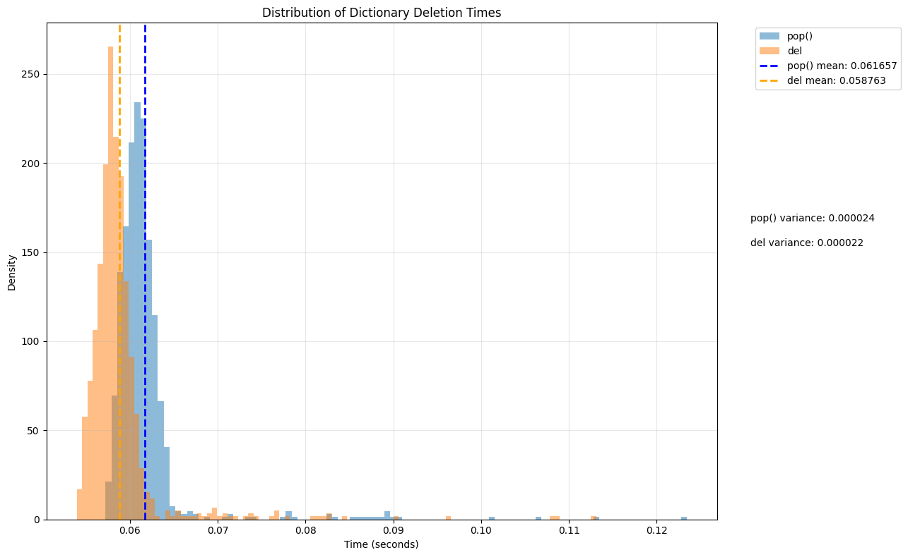

Here are a number of observations about various "interesting" behaviours in Python I have collected over the years:

<!-- more -->

## Forking vs Spawning

You'll get a different output for the following lines of code on a MacOS vs on a Linux

```python

import pickle
import multiprocessing

class Container:
    def __init__(self):
        self.data = list(range(100))
    
    def __getstate__(self):
        print("Pickling Container")
        return self.__dict__

    def __setstate__(self, state):
        print("Unpickling Container")
        self.__dict__ = state

class ProcessingEg:
    def __init__(self):
        self.container = Container()

    def __getstate__(self):
        print("Pickling ProcessingEg")
        return self.__dict__

    def __setstate__(self, state):
        print("Unpickling ProcessingEg")
        self.__dict__ = state

    def method(self):
        print(f"Method called, container data: {self.container.data[:5]}...")

def worker(func):
    print("Worker process started")
    func()

if __name__ == "__main__":
    pe = ProcessingEg()

    print("Pickling process starting")
    pickled_method = pickle.dumps(pe.method)
    print(f"Pickled size: {len(pickled_method)} bytes")

    print("\nUnpickling process starting")
    unpickled_method = pickle.loads(pickled_method)
    print(f"Unpickled type: {type(unpickled_method)}")

    print("\nStarting multiprocessing")
    p = multiprocessing.Process(target=worker, args=(unpickled_method,))
    p.start()
    p.join()
```

in macos, output is:
```
Pickling process starting
Pickling ProcessingEg
Pickling Container
Pickled size: 329 bytes

Unpickling process starting
Unpickling Container
Unpickling ProcessingEg
Unpickled type: <class 'method'>

Starting multiprocessing
Pickling ProcessingEg
Pickling Container
Unpickling Container
Unpickling ProcessingEg
Worker process started
Method called, container data: [0, 1, 2, 3, 4]...
```

while on linux, this is
```
Pickling process starting
Pickling ProcessingEg
Pickling Container
Pickled size: 329 bytes

Unpickling process starting
Unpickling Container
Unpickling ProcessingEg
Unpickled type: <class 'method'>

Starting multiprocessing
Worker process started
Method called, container data: [0, 1, 2, 3, 4]...
```

In Python's multiprocessing:

1. macOS uses spawn by default (since Python 3.8)
2. Linux/Unix uses fork by default

The difference in output comes from this difference - how Python’s multiprocessing module creates new processes on different operating systems.

### macOS (spawn)
The default start method is spawn. The spawn start method does not copy the parent’s memory. 

Instead, it starts a fresh Python interpreter process and then passes necessary objects from the parent to the child by ***pickling*** them and sending them over some form of inter-process communication (like named pipes, message queues etc.).

This means that every object the child process needs— functions, classes, instances — must be pickled in the parent and unpickled in the child. As a result, there are multiple print statements from the `__getstate__` (pickling - when `dumps` is called) and `__setstate__` (unpickling - when `loads` is called) methods.


### Linux (fork)
When a new process is created using fork, it duplicates the parent process's memory space, including all Python objects. Because the child process starts as a near-identical copy of the parent, objects do not need to be re-serialized (pickled) and then deserialized (unpickled) to be available in the child. This results in fewer calls to `__getstate__` and `__setstate__`.


### Difference in output
Taking a look at the print statements again:

```
Starting multiprocessing

# <--The following lines appear in spawn, but not in fork-->
Pickling ProcessingEg
Pickling Container
Unpickling Container
Unpickling ProcessingEg
# <---->

Worker process started
```

The additional print statements that happen when `spawn` gets used in macOS regarding pickling/unpickling basically comes from the additional calls to `__getstate__` and `__setstate__` that come from `pickle.dumps` and `pickle.loads` calling them respectively.


## Different ways of deleting a key from a dictionary

Look at the difference in the time it takes 2 different methods to remove an element from a dictionary in Python:

```python
import time

num = 10**6
test_dict = {i: i for i in range(num)}
start = time.time()
for i in range(num):
    test_dict.pop(i)
end = time.time()
pop_time = end - start
print(pop_time)
test_dict = {i: i for i in range(num)}
start = time.time()
for i in range(num):
    del test_dict[i]
end = time.time()
del_time = end - start
print(del_time)
```
The output is 

```
0.06211280822753906
0.060539960861206055
```
And the ratio is
```python
((pop_time - del_time) / pop_time) * 100
# 2.5322432058959006
```
Let's do a slightly more rigorous statistical analysis of this difference. Here's the code for it:

```python
import time
import matplotlib.pyplot as plt
import numpy as np
from tqdm import tqdm

num = 10**6
num_experiments = 10**3
pop_times = []
for _ in tqdm(range(num_experiments)):
    test_dict = {i: i for i in range(num)}
    start = time.time()
    for i in range(num):
        test_dict.pop(i)
    end = time.time()
    pop_time = end - start
    pop_times.append(pop_time)

del_times = []
for _ in tqdm(range(num_experiments)):
    test_dict = {i: i for i in range(num)}
    start = time.time()
    for i in range(num):

        del test_dict[i]
        
    end = time.time()
    del_time = end - start
    del_times.append(del_time)

# First, create a figure and axis objects explicitly
plt.figure(figsize=(12, 8))
ax = plt.gca()

pop_mean = np.mean(pop_times)
pop_var = np.var(pop_times)
del_mean = np.mean(del_times)
del_var = np.var(del_times)

# Plot individual points
# scatter
# plt.scatter(range(len(pop_times)), pop_times, alpha=0.5, label='pop()', s=5)
# plt.scatter(range(len(del_times)), del_times, alpha=0.5, label='del', s=5)
# histogram
plt.hist(pop_times, bins=100, alpha=0.5, label='pop()', density=True)
plt.hist(del_times, bins=100, alpha=0.5, label='del', density=True)

# Add horizontal lines for means
# scatter
# plt.axhline(pop_mean, color='blue', linestyle='dashed', linewidth=2, label=f'pop() mean: {pop_mean:.6f}')
# plt.axhline(del_mean, color='orange', linestyle='dashed', linewidth=2, label=f'del mean: {del_mean:.6f}')
# histogram
# Add vertical lines for means
plt.axvline(pop_mean, color='blue', linestyle='dashed', linewidth=2, label=f'pop() mean: {pop_mean:.6f}')
plt.axvline(del_mean, color='orange', linestyle='dashed', linewidth=2, label=f'del mean: {del_mean:.6f}')

# Place legend outside to the right
plt.legend(bbox_to_anchor=(1.05, 1), loc='upper left')

# Add text annotations for variances below the legend
plt.text(1.05, 0.6, f'pop() variance: {pop_var:.6f}', transform=ax.transAxes)
plt.text(1.05, 0.55, f'del variance: {del_var:.6f}', transform=ax.transAxes)

plt.title('Distribution of Dictionary Deletion Times')
# scatter
# plt.xlabel('Experiment Number')
# plt.ylabel('Time (seconds)')
# histogram
plt.xlabel('Time (seconds)')
plt.ylabel('Density')
plt.grid(True, alpha=0.3)

# Adjust layout to make room for legend and text
plt.tight_layout()
plt.subplots_adjust(right=0.85)  # This makes room for the legend and text on the right

plt.show()

```



Seems statistically significant - let's just confirm:

```python
from scipy import stats

t_stat, p_value = stats.ttest_rel(pop_times, del_times)
print(p_value) # <- 1.1523452235190812e-37
```
i.e. there is a probability of 1.1523452235190812e-37 of this deviation happening at random. So we can conclude that this roughly ~2.5% difference is actually statistically significant!